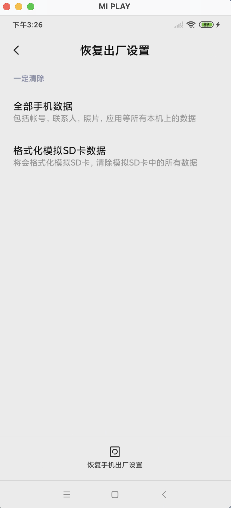
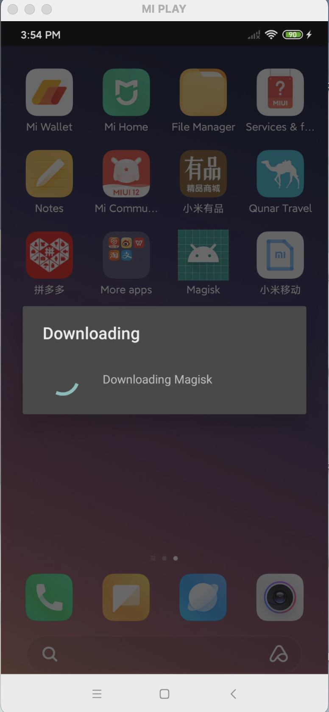

# 探针计划

## 目标
  - 远程控制
  - nmap局域网端口扫描
  - ping服务器测验

## 1. 恢复出厂设置
  开机后开启USB调试
  

## 2. 重新安装Magisk并安装TermuX
  ```
  adb devices

  cd /Users/charlieyin/Documents/Android/Magisk_v30.7

  adb install Magisk-v30.7.apk
  ```
  ### 问题1：恢复出厂设置后无法安装Magisk，执行su后没有反应
    
    ```
    charlieyin@mac ~ % adb shell
    lotus:/ $ which su
    /sbin/su
    lotus:/ $ su -v
    30.7:MAGISKSU
    lotus:/ $ su
    whomai
    whoami
    id
    ```
    解决方法：卸载开机自带的Magisk，重新安装
  
## 3. 安装Termux
  ### 问题2：即使开启USB安装也无法ABD安装termux(疑似MIUI拦截）
  ```
  charlieyin@mac ~/Documents/Android/Termux % adb install termux-app_v0.118.3+github-debug_arm64-v8a.apk
Performing Streamed Install
adb: failed to install termux-app_v0.118.3+github-debug_arm64-v8a.apk: Failure [INSTALL_FAILED_USER_RESTRICTED: Install canceled by user]
```
  解决方法：电脑下好的APK复制到到手机，然后ROOT权限安装
  ```
  charlieyin@mac ~/Documents/Android/Termux % adb push ~/Documents/Android/Termux/termux-app_v0.118.3+github-debug_arm64-v8a.apk /data/local/tmp/termux.apk
/Users/charlieyin/Documents/Android/Termux/termux-app_v0.118.3+... 1 file pushed, 0 skipped. 14.7 MB/s (35106607 bytes in 2.285s)
charlieyin@mac ~/Documents/Android/Termux % adb shell su -c "pm install -r /data/local/tmp/termux.apk"
Success
```
## 4. 安装Tailscale
  ```
  adb install tailscale-android-universal-1.98.8.apk
  ```
  然后登陆账号并记住tailscale IP地址
  
## 5. 安装SSH
  进入Termux后：
  ```
  pkg update
  pkg upgrade
  pkg install openssh
  sshd -V
  ```

  记录并设置Termux用户密码:
  ```
  whoami

  passwd
  ```

  开启SSH并查看SSH端口：
  ```
  sshd

  ss -ltn
  ```
  mac SSH到手机:
  `ssh -p 8022 u0_aXXX@100.XXX.XX.XX`

## 6.安装与测试nmap
  ```
  pkg install nmap

  nmap --version
  ```
  ### 问题3: Root shell没有继承Termux的环境，没法开启nmap ROOT权限扫描
  su后进入的是安卓自己的shell，它的路径在:
  ```
  /data/data/com.termux/files/home # echo $PATH
  
  /debug_ramdisk:/sbin:/sbin/su:/su/bin:/su/xbin:/system/bin:/system/xbin
  ```
    
  而nmap这种在Termux同个pkg下载的软件文件路径在：
  ```
  /data/data/com.termux/files/usr/bin
  ```
    
  因此Root Shell找不到nmap指令
  
  临时修复（只对当前这一次Root Shell生效），告诉Root Shell找程序时先去Termux的bin目录看看。进入Root Shell后输入:
  ```
  export PATH=/data/data/com.termux/files/usr/bin:$PATH
  echo $PATH
  ```
    
  长久方案是安装tsu。操作如下：
  ```
  pkg install root-repo

  pkg install tsu
  
  echo $PATH（可选，打印当前的Root Shell路径，只要出现termux/files就说明路径已继承）
  ```
  #### 原理：
  - 普通su: Termux → su → Root → Android原生Shell（只剩系统PATH）
  - tsu: Termux → 保存环境变量 → su → 恢复环境变量 → Root + Termux
  

测试nmap
TCP Connect | nmap -sT 127.0.0.1
SYN Scan (Root) | nmap -sS 127.0.0.1
UDP Scan (Root) | nmap -sU 127.0.0.1
OS Detection (Root) | nmap -O 127.0.0.1


  


